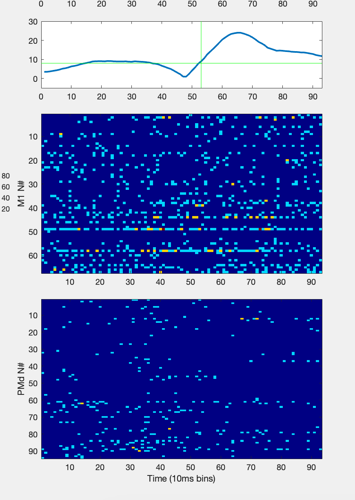
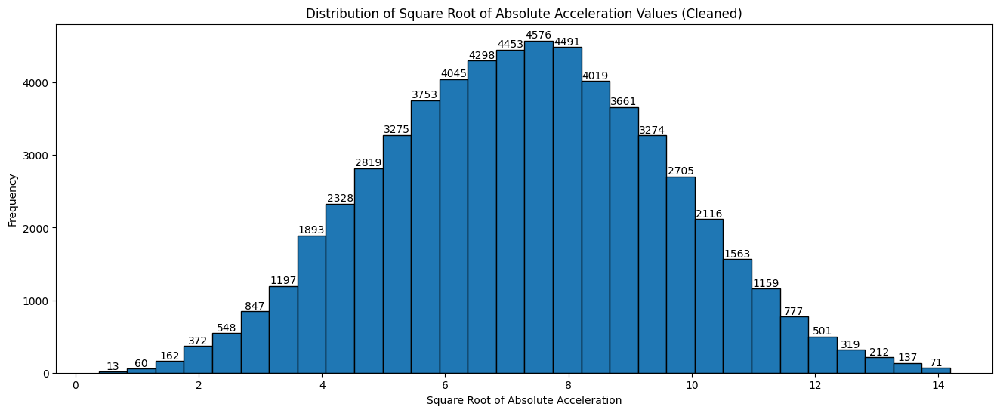
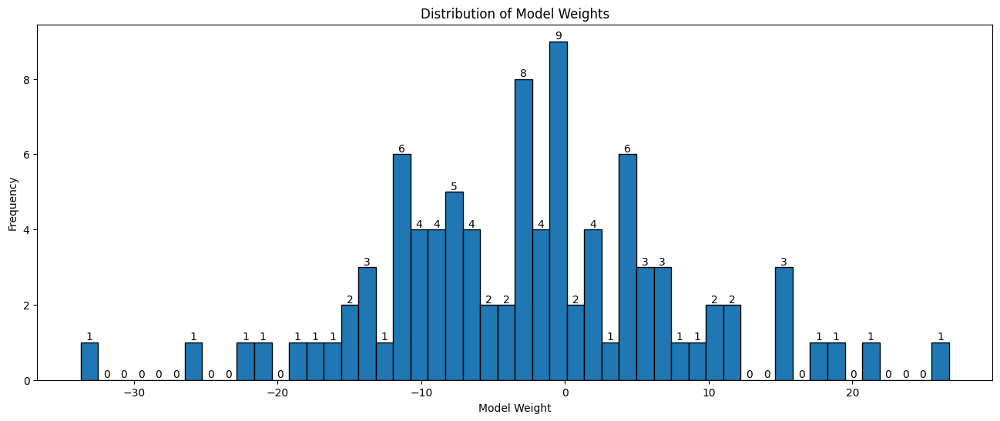
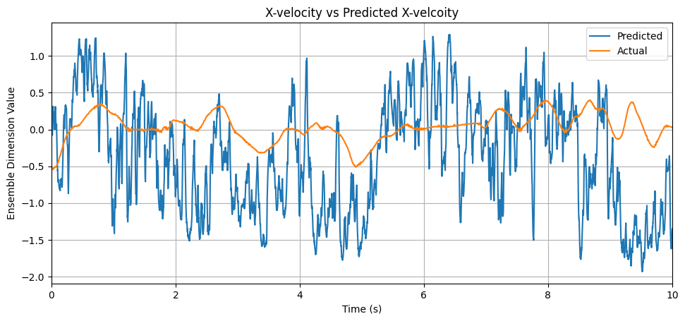
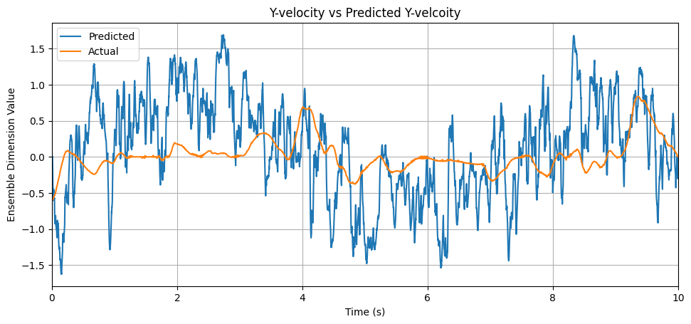
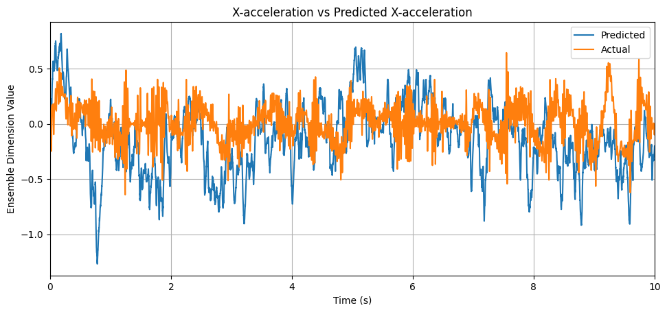
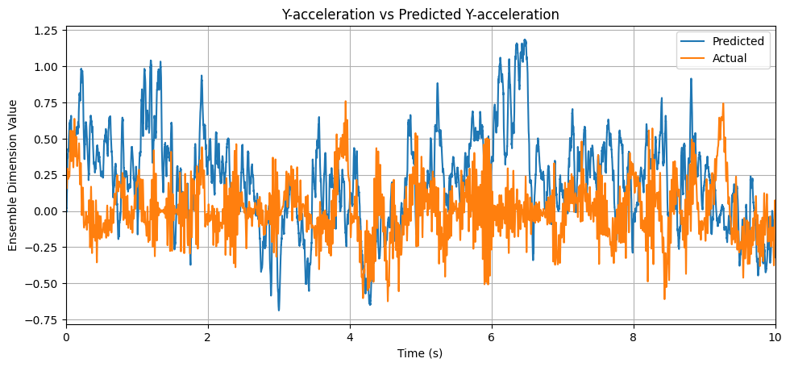

# 

### Contents
1. [Project Overview](#exploration-of-data)
2. [Preliminary exploration of data](#preliminary-exploration-of-data)
3. [Investigation of a Single Trial](#investigation-of-a-single-trial)
4. [Implementing a Linear Decoder Function](#linear-decoder-function)
5. [Implementing a Nengo Decoding Model](#nengo-functional-decoder-model)


## Project Overview
BCI Signal Decoding aims to develop a model capable of translating neural activity into movements. To achieve this, we attempt to integrate spiking neural networks (SNNs) with real-world data collected from the motor and pre-motor cortices of macaques.

The following sections in this document outline our progress for the F24 term, including preliminary data exploration, investigations of an individual trial, and the implementation of least-effort models using linear decoders.

## Preliminary exploration of data
The experimental data sourced from CRCNS is available in both raw and processed formats. In summary, the raw data includes time series information regarding both neural and kinematic activity, recorded at millisecond intervals for each trial, in addition to metadata such as target location for each trial attempt. The processed data organizes the raw information into 10ms time bins and crops the continuous raw data into individual trials that can be analyzed, using predefined velocity thresholds to mark the start and end of each trial.

For further information on the details of the data structures, see the official documentation in `Data Extraction/crcns_pmd-1_data_description.pdf`.

**Raw Data:**
| File Name         | Monkey | # Trials | # Neurons (M1) | # Neurons (PMd) |
|-------------------|--------|----------|----------------|-----------------|
| MM_S1_raw.mat     | MM     | 140      | 67             | 94              |
| MT_S1_raw.mat     | MT     | 116      | 0              | 49              |
| MT_S2_raw.mat     | MT     | 178      | 0              | 46              |
| MT_S3_raw.mat     | MT     | 174      | 0              | 57              |

**Processed Data:**
| File Name            | Monkey | # Reaches | # Neurons (M1) | # Neurons (PMd) |
|----------------------|--------|-----------|----------------|-----------------|
| MM_S1_processed.mat  | MM     | 496       | 67             | 94              |
| MT_S1_processed.mat  | MT     | 419       | 0              | 49              |
| MT_S2_processed.mat  | MT     | 646       | 0              | 46              |
| MT_S3_processed.mat  | MT     | 652       | 0              | 57              |

### Results
A preliminary attempt to correlate the total number of activations per time bin to the absolute velocity/acceleration (x and y) yielded poor linear correlation, with $|r| < 0.3$.

However, it is of note that the relationship between neural activity and kinematic output may involve time delays


In visualizations of certain trials, we notice that neural activity in the pre-motor cortex (PMd) is heightened about 10 time bins before the reach begins, where the threshold velocity is marked in green. This result reflects the biological nature of the pre-motor cortex, which is often attributed to the planning and preparation stage in voluntary movement. It also suggests that a form of memory retention architecture, such as the Legendre Memory Unit, is likely needed.

### Additional Notes

While there are three separate datasets for the monkey MT, there is no indication of whether a neuron in one dataset corresponds to a neuron of the same id in another dataset. Therefore, we will likely need to treat these datasets separately.


## Investigating a Single Reach
We first isolate a single reach attempt, trial 1 of processed `MM_S1`. This investigation focuses on applying a *linear regression model* on the frequency of absolute acceleration values and the total neural activity in the pre-motor cortex.

**Cleaning up data**
To clean the data for absolute acceleration, we remove outliers exceeding three standard deviations from the square root of the distribution. The decision to use $\sqrt{\text{acceleration}}$ was made after visualizing graphs of {$|\text{acceleration}|$, $log(|\text{acceleration}|)$, and $\sqrt{|\text{acceleration}|}$ } and selecting the transformation that most closely resembled a normal distribution.

Resultant target distribution



The process for cleaning the neural activity data was removing an outlier (52) with 0 activations throughout the entire trial. In general, neurons activated between 0-3 times per time bin, with one neuron (82) activating up to 4 times for a time bin.

**Results**

Weights after training



Correlation Metrics:
- Mean Squared Error: 1232.8408291151804
- Root Mean Squared Error: 35.111833177935615
- R^2 Score: 0.008022257983193337

Simple time shifts in the range of {1, 2, 3, 15, 50} were also tested to account for possible fixed time delays. However, there were no visible improvements in error metrics. Generally, 

- Mean squared error: > 1000
- Root mean squared error: > 30
- R^2: < 0.01

Again, the results show that a direct linear regression performs poorly when modeling neural and kinematic data. 

We thus attempt one more Least effort model using Linear decoders. 

## Linear Decoder Function


Similar to the previous explorations, the linear decoder function takes in a matrix of neural activations and attempts to match this input to an output kinematic matrix of [x_velocity, y_velocity, x_acceleration, y_acceleration].

**Preparing the Matrices**
The kinematic data is scaled using Scikit learn's `StandardScaler`. After scaling, kinematic and neural data is split 40/60 into test/train sets.

Then, each is compiled into their corresponding Activation and Output matrices and transposed:
```
# n_neurons x n_timepoints
A := nxN activity matrix

# n_kinematics x n_timepoints
Y := dxN ideal output matrix
```

Then, the least squares solution is computed for the decoder $D$ that solves the linear mapping:
$$\hat{Y} = DA$$

```python
D = np.linalg.lstsq(A @ A.T, A @ Y.T, rcond=None)[0].T

# @: Matrix multiplication operator
# A @ A.T: Covariance matrix for neural activity, how neurons are related to each other
# A @ Y.T: Cross covariance matrix between neural activity and kinematics, how much each neuron contributes to each kinematic variable
```

Note: Least square solution minimizes the squared error between the predicted and actual kinematics.

We also conduct a similar calculation for the regularized (generalized by adding noise from a Guassian distribution) decoder: ?
```python
D_reg = np.linalg.lstsq(A @ A.T + A.shape[1] * np.square(np.random.normal(0,20,1)) * np.eye(n_neurons), A @ Y.T, rcond=None)[0].T
```

### Results

> Note: This uses raw data rather than processed data

| Metric                | MM_S1 Functional Decoder | MM_S1 L2 Regression | MT_S1 Functional Decoder | MT_S1 L2 Regression | MT_S2 Functional Decoder | MT_S2 L2 Regression | MT_S3 Functional Decoder | MT_S3 L2 Regression |
|-----------------------|--------------------------|----------------------|--------------------------|----------------------|--------------------------|----------------------|--------------------------|----------------------|
| X Velocity            | 0.9721                  | 0.9977              | 0.9607                  | 0.9831              | 0.9821                  | 1.0084              | 0.9473                  | 0.9943              |
| Y Velocity            | 0.9641                  | 0.9972              | 0.9571                  | 0.9937              | 0.9837                  | 1.0043              | 0.9630                  | 0.9987              |
| X Acceleration        | 0.9896                  | 1.0014              | 0.9903                  | 0.9978              | 0.9944                  | 1.0002              | 0.9830                  | 0.9954              |
| Y Acceleration        | 0.9945                  | 1.0004              | 0.9864                  | 0.9950              | 0.9913                  | 1.0015              | 0.9917                  | 1.0051              |


Next steps in Investigation:
- Varying noise level


## Nengo Functional Decoder model

Now, we attempt to construct a Nengo SNN model using the calculated decoder outputs.

Hyper parameters:
```python
# Parameters to change
n_ensemble_neurons = 5000
ensemble_radius = 1
ensemble_decoder = decoder_reg
ensemble_synapse = 0.025
probe_synapse = 0.01

```

Acceleration and Velocities were normalized relative to the max value.

### Results






> Note: Increasing the synpase time showed improvements in pattern matching

